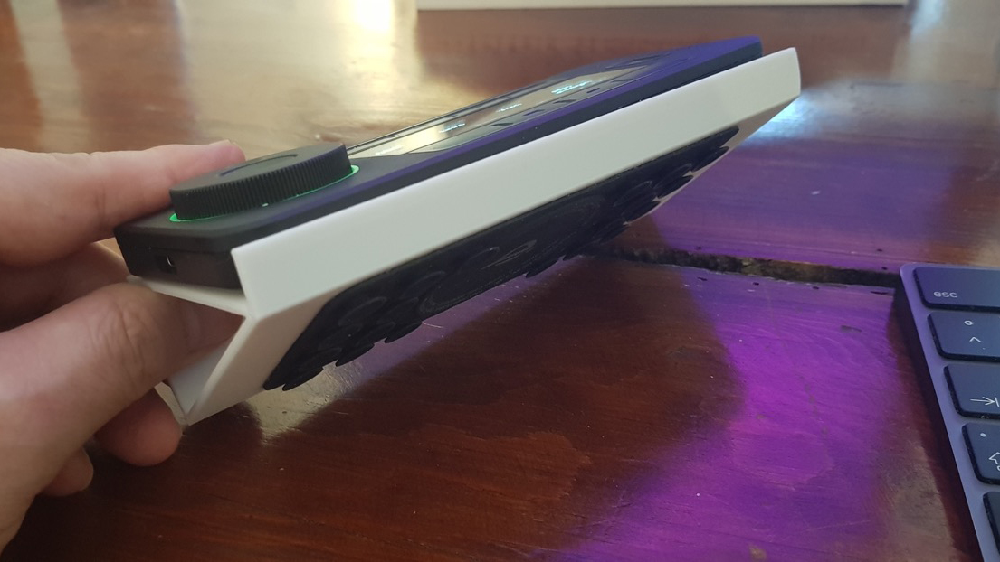

# Universal Stand Customizer

> Customizable stand for your devices and other stuff.

by IOIO72 aka Tamio Patrick Honma (https://honma.de)

## Updates

**2022-02-21:** Add experimental feature *Reduce Filament Consumption*

## Description

Whether you want to use a device in an angled position or present something in an optimal orientation, you can design a stand to suit your needs.

This model is customizable to generate STL files for your individual use case. Included in this package are some examples and inspirations for smartphones, tablets, notebooks, business cards, table name cards, print magazines, keyboards, etc.

## Customization

**Basic configuration:**

1. Measure the `width` and `depth` of your device or object in millimeters and enter the values into the customizer.

2. Determine the height of the device at the front of the stand that will prevent the device or object from sliding off the stand. This can be the measured height of your device or object, if applicable. Enter the value of the `stopper height` into the customizer.

3. Enter the desired `angle` at which you want your device or object to be presented, which is the main purpose of the stand.

**Foot configuration:**

1. Define the `foot depth` to prevent the stand of sliding, especially concerning interactive devices. You should add a rubber tape on the bottom of the foot or a weight on top of it.
2. You are able to set the `foot orientation` behind, centered or in front of the stand leg.

**Advanced configuration:**

1. Define the `stand thickness` in relationship of the steadiness requirements and material consumption.
2. Define the `height` of the table plate for your device. The height is the thickness of the plate on which your device will be placed, if you will.
3. Set the number of fragments (`$fn`), especially to smooth or de-smooth the curve of the leg.

**Reduce Filament Consumption (experimental) configuration:**

1. Use these experimental parameters **with caution**. Be careful not to overstress your printer's ability to print overhangs. Also, find a good compromise between stand strength and filament reduction. You can also increase the `stand thickness` in the Advanced Configuration section.
2. The higher the `decrease percentage`, the larger the hole and the lower the steadiness of the stand.
3. To apply the filament consumption reduction to the table top of the stand, enable the `decrease table` option.
4. To apply the filament consumption reduction to the back plate (leg) of the stand, activate the `decrease back` option.

**Tips:**

* To test your configured stand, you could consider to cancel the print after some layers and test the angle and steadiness.
* If you use the stand for an interactive device, you should glue a rubber tape on the bottom of the foot to prevent the stand to slide away while using the device. To improve the adhesion, you may increase the depth of the foot in the foot options. Additionally you may add a weight on top of the foot.

### Use OpenSCAD

1. **Download and install:** [OpenSCAD](http://openscad.org/) version 2021.01 or newer
2. **Download:** The *.scad file of this model.
3. **Start** OpenSCAD and **open** the *.scad file in it.
4. **Open the customizer** via the menu "Window/Customizer"

Now you can configure the model and use the `F5` key to render the preview of your changes.

#### Export your STL file

If you're done with your model settings, you can export the STL file:

1. Render the mesh by pressing the `F6` key.
2. Wait until the rendering is finished. This might take some minutes.
3. Export the STL file by pressing the `F7` key.

#### Optionally save your configuration

If you like to use your configuration as a template for further models, it's a good idea, to save your configuration:

1. Click the `+` symbol in the customizer, which you find beside the configuration selector drop-down in the second line of the customizer.
2. Give your configuration a name.

Use the drop-down menu to access your saved configurations.

## Print

Use a **brim** for better bed adhesion.

Instead of infill you may consider to increase the amount of walls of the shell, which should lead to faster prints.

## Post Printing

### Tip for interactive devices like smartphones

You should add a rubber tape and weight on the foot of the stand to prevent the stand to slip away.

